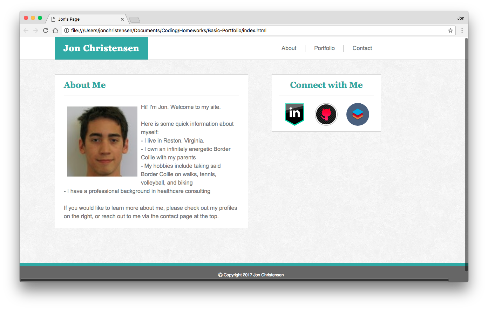

# Basic-Portfolio
This is an extremely basic personal website built solely using HTML5 and CSS3. A live version can be viewed at https://jonchr.github.io/Basic-Portfolio

## Description

This page serves as first attempt at a personal portfolio page consisting of three different pages. The main page offers a brief  self-introduction section and can be accessed by clicking on my name or the 'About' section in the header. The portfolio page offers links to my projects - although since I did not yet have any projects to show, I decided to include pictures of my dog, Annabelle. Lastly, the contact me page contains an HTML form to send me an email; however, since this is solely a front-end HTML only page, clicking the submit button will only open a new email in your default mail app.

Each page contains a header with links to all pages at the top, a section on the right with links to my LinkedIn, Github, and StackOverflow profiles, and a sticky footer.

### Development

This site was developed as part of the GW Coding Bootcamp and was built in the first week. Each page was built using HTML5 and CSS3. 

At this point in the bootcamp, we had not covered responsive web design, and thus this site may not display correct on mobile devices or if you adjust the size. To view the responsive version of this page, please see the repo at https://github.com/jonchr/Responsive-Portfolio.

This page uses the Meyerweb Reset CSS file v2.0 available to the public domain at http://meyerweb.com/eric/tools/css/reset/

The background image for this page is **Redox 01** and was used with permission from https://www.toptal.com/designers/subtlepatterns/redox-01/

## Screenshots
### Main/About Page

